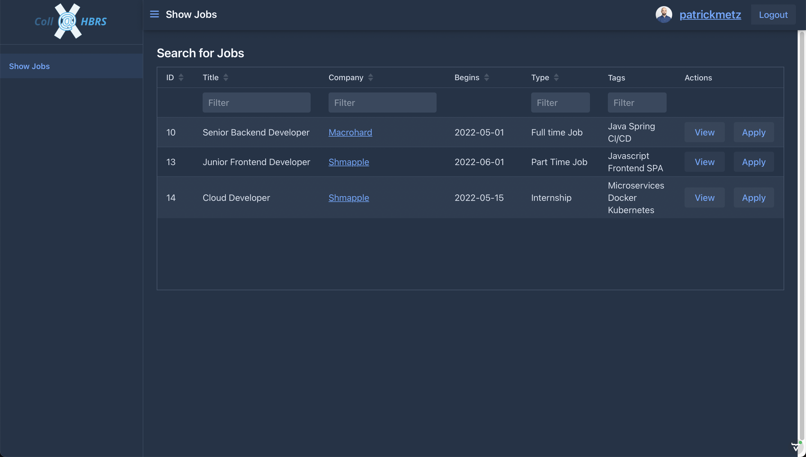

# Semesterprojekt - Software Engineering 2
 - Wintersemester 2021 / 2022
 - [Homepage Hochschule Bonn-Rhein-Sieg](https://www.h-brs.de)
 - [Beschreibung der Vorlesung](https://eva2.inf.h-brs.de/studium/curriculum/2017/matrix/bi/308/de/)

## Ziel
 - Entwicklung von Web-basiertem Studenten-Job-Portal
   - durch anfangs 11, später 8, Team-Mitglieder
   - auf Basis von Vaadin, Springboot und Hibernate / JPA
   - aus 70 Anforderungen aus Stakeholder-Interviews
   - innerhalb schichtbasierter Architektur (GUI, Anwendungslogik, Persistenz)
   - agil, test-driven und mit CI/CD-Pipeline
   - Entwurfsmuster:  Chain Of Responsibility, Factory, (Test-)Builder, Observer, Proxy, Round-Trip-Test
   - fokussiert auf Requirements Engineering, Usabilty, Continuous Delivery und fortgeschrittener Objektorientierung

## Ergebnis
- Funktionalität
  - unbekannte Benutzer können sich als Unternehmen oder Student registrieren
  - angemeldete Benutzer können ihre Profile verwalten
  - Unternehmen können ihre Stellenanzeigen und Bewerber verwalten
  - Studenten können Stellenanzeigen durchsuchen, anzeigen und sich darauf bewerben

## Meine Aufgaben / beste Beiträge
- Team-Leitung
  - Umsetzung der Projekt-Vision / -Ziele
  - Koordination der Arbeit
  - MVP- und Sprint-Planung
  - Aufwandsschätzung
  - Einhaltung der Qualitäts-Metriken
  - **bester Beitrag**: Betreuung _sämtlicher_ Team-Mitglieder bei Konzeption und Umsetzung Ihrer Aufgaben
- Architektur / diverse Engineering-Artefakte
  - Übersicht: [Google-Doc](https://docs.google.com/document/d/1O_SIUEWhr0FvvkfKCYLNg5KqFiB9TqLD6qdcywgAxPM/edit?usp=sharing)
  - **beste Beiträge**: [Objekt-orientierte Analyse der Haupt-Features](https://docs.google.com/document/d/1Ttjw5QMVVV-0D4MwIyWAkd0PLL5quoIRPGx1hCtO8dc), [Use-Cases der Haupt-Features](https://docs.google.com/document/d/1ZL-Z_ELLWn1hHTbOsrx4x42Bfres6iIceI6B8idpqIk/edit?usp=sharing), [Baustein-Sicht](https://docs.google.com/document/d/19UZ_iGht-cLhqhDVej139etZp3yHERYT872hyqFBTVk/edit?usp=sharing), [Requirements-Matrix](https://docs.google.com/spreadsheets/d/19i0lQqP67ZV70MpSDR-_uOZaWQPz6h4Lv-QMIsDylRc/edit?usp=sharing)
- Entwicklung
  - Mitarbeit an allen wesentlichen Controllern, all ihrer Tests und Abhängigkeiten (Factories, Builders, JPA-Repositories, Hibernate-Entities, DTOs und DAOs, Round-Trip-Tests)
    - **beste Beiträge**: 
      - zentrale Controller für [Benutzerverwaltung](src/main/java/org/hbrs/se2/project/hellocar/control/ManageUserControl.java), [Stellenanzeigenverwaltung](src/main/java/org/hbrs/se2/project/hellocar/control/ManageJobAdvertisementControl.java) und [Bewerbungsverwaltung](src/main/java/org/hbrs/se2/project/hellocar/control/ManageJobApplicationControl.java)

## Screenshot

 
	
